# Writeup

## Advanced Lane Finding Project


The goals / steps of this project are the following:

- Compute the camera calibration matrix and distortion coefficients given a set of chessboard images.
- Apply a distortion correction to raw images.
- Use color transforms, gradients, etc., to create a thresholded binary image.
- Apply a perspective transform to rectify binary image ("birds-eye view").
- Detect lane pixels and fit to find the lane boundary.
- Determine the curvature of the lane and vehicle position with respect to center.
- Warp the detected lane boundaries back onto the original image.
- Output visual display of the lane boundaries and numerical estimation of lane curvature and vehicle position.

---

Prepare our basic tools: OpenCV, matplotlib and numpy.


```python
import cv2
from matplotlib import pyplot as plt
import numpy as np
```

---

## Camera calibration

### Task:

*Briefly state how you computed the camera matrix and distortion coefficients. Provide an example of a distortion corrected calibration image.*

We'll begin camera calibration after reading all available images.


```python
import glob
def load_images(load_path):
    image_paths = glob.glob(load_path)
    images = [plt.imread(path) for path in image_paths]
    return images
        
def display_grid(images, n_col, title, cmap=None, figsize=(15,7)):
    plt.close('all')
    fig, ax_arr = plt.subplots(len(images)//n_col, n_col, figsize=figsize)
    fig.tight_layout()
    fig.suptitle(title, fontsize=30)
    for i, image in enumerate(images):
        ax = ax_arr[i // n_col, i % n_col]
        ax.imshow(image,cmap=cmap)
    plt.show()


calibration_images = load_images("camera_cal/*.jpg")
print("There are {} images for calibrating camera".format(len(calibration_images)))
display_grid(calibration_images, 5, "Images for camera calibration", figsize=(15,11))
```

    There are 20 images for calibrating camera


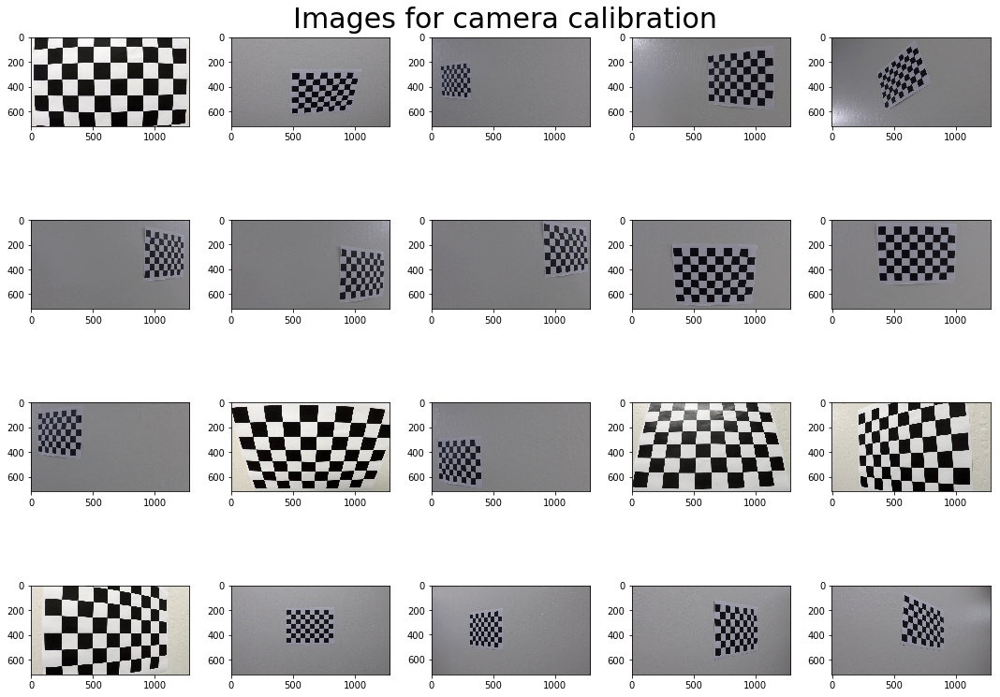


As shown above there are 20 images. Using them we could do camera calibration.


To calibrate camera I have to found out calibration parameters. It is known, that calibration chessboard has pattern size equal to 9x6. That's enough to find chessboard corners with method `cv2.findChessboardCorners`. Then, I setup object points - points in 3D space and call `cv2.calibrateCamera` to finally get parameters `mtx` and `dist` to be abble to undistort any given image.

After getting undistorted images there is a need to transform image perspective. We have to know `corners` which were set in previous step and that's all. Displaying images we can see that some of them weren't undistorted and transformed.


```python
def find_corners(image, pattern_size):
    """
    Look for the corners on chessboard image given pattern size
    
    Args:
        image: cv2.image
        pattern_size: tuple
    
    Returns:
        List of corners coordinates if they are found
    """
    
    gray = cv2.cvtColor(image, cv2.COLOR_RGB2GRAY)
    retval, corners = cv2.findChessboardCorners(gray, pattern_size)
    return corners if retval else []

def find_calibration_parameters(images, pattern_size):
    """
    Find out calibration parameters. 
    
    Args:
        image: cv2.image
        pattern_size: tuple
    
    Returns:
        ret: boolean – true if calibration was successfull
        rest parameters - camera matrix, distortion coefficients and used array of corners
    """
    return_corners = list(map(lambda x: find_corners(x, pattern_size), images))
    corners = list(filter(lambda x: len(x) != 0, return_corners))

    objp_size = np.prod(pattern_size), 3
    objp = np.zeros(objp_size, np.float32)
    objp[:,:2] = np.mgrid[0:pattern_size[0], 0:pattern_size[1]].T.reshape(-1,2)
    objpoints = [objp] * len(corners)
    
    image_size = images[-1].shape[1::-1]
    ret, mtx, dist, *rest = cv2.calibrateCamera(objpoints, corners, image_size, None, None)
    
    return ret, mtx, dist, return_corners

def undistort_images(images, mtx, dist):
    return [cv2.undistort(image, mtx, dist) for image in images]

def draw_vision_area(image, corners):
    src = np.float32([corners[0], corners[1], corners[-1], corners[-2]])
    image_size = image.shape[1::-1]
    pts = np.array(src, np.int32)
    pts = pts.reshape((-1,1,2))
    return cv2.polylines(image, [pts], True, (255, 0,0), 20)
    
def transform_perspective(image, corners, pattern_size = (2,2), offset = 0, inverted = False):
    if len(corners) == 0:
        img = image.copy()
        cv2.putText(img, "Failed", (10, 100), cv2.FONT_ITALIC, 4.0, (0, 0, 255), 6, cv2.LINE_AA)
        return img
    nx, ny = pattern_size
    src = np.float32([corners[0], corners[nx-1], corners[-1], corners[-nx]])
    image_size = image.shape[1::-1]
    (w, h), d = image_size, offset
    dst = np.float32([[d, d], [w - d, d], [w-d, h-d], [d, h - d]])
    M = cv2.getPerspectiveTransform(dst, src) if inverted else cv2.getPerspectiveTransform(src, dst)
    return cv2.warpPerspective(image, M, image_size)
```


```python
ps = (9, 6)
ret, mtx, dist, corners = find_calibration_parameters(calibration_images, pattern_size=ps)

if ret:
    undistorted_images = undistort_images(calibration_images, mtx, dist)
#     display_grid(undistorted_images, 5, "Undistorted images")

    transformed_images = [transform_perspective(image, corners[i], pattern_size=ps, offset=100) \
                          for i, image in enumerate(undistorted_images)]
    display_grid(transformed_images, 5, "Undistorted and Transformed images", figsize=(15,11))
```


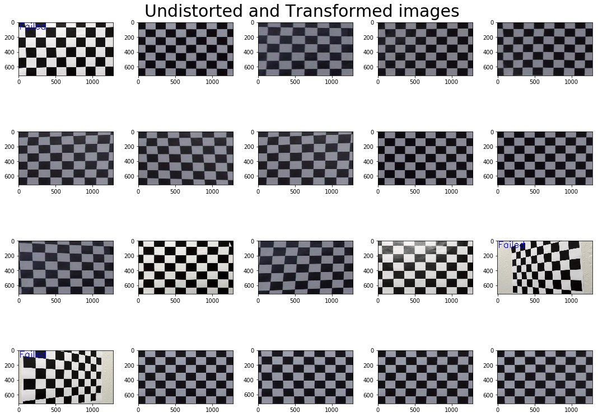


It's interesting to note that some images aren't helpful because the `findChessboardCorners` method cannot detect corners on them.

---

# Pipeline (for `test_images` folder)

First off all, load images from folder.


```python
test_images = load_images("test_images/*.jpg")
display_grid(test_images, 4, "Test images")
```


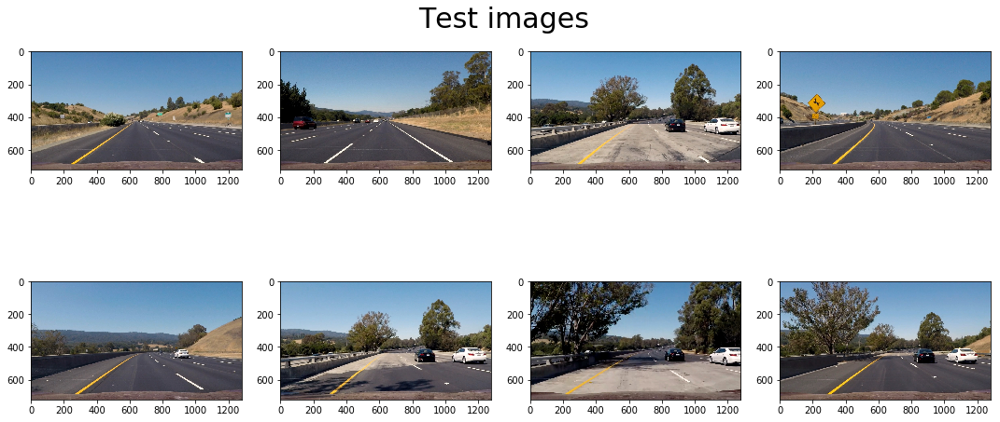


### Task:


*Provide an example of a distortion-corrected image.*


*Describe how (and identify where in your code) you performed a perspective transform and provide an example of a transformed image.*

To do a perspective transform I need to setup corners. All other transformations are done with help of available methods


```python
get_corners = lambda w, h: [(0.45*w, 0.62*h), (0.55*w, 0.62*h), (0.05*w, 0.95*h), (0.95*w, 0.95*h)]

def undistort_and_transform_perspective(images):
    undistorted_images = undistort_images(images, mtx, dist)
    h, w, *_ = images[-1].shape
    corners = get_corners(w, h)
    transformed_images = [draw_vision_area(image.copy(), corners) \
                          for i, image in enumerate(undistorted_images)]
    display_grid(transformed_images, 4, "Undistored images with source points drawn")
    
    transformed_images = [transform_perspective(image, corners) \
                          for i, image in enumerate(undistorted_images)]
    display_grid(transformed_images, 4, "Birds-eye perspective")
    
    transformed_images = [transform_perspective(image, corners, inverted=True) \
                          for i, image in enumerate(undistorted_images)]
    display_grid(transformed_images, 4, "Inversed perspective")
    
undistort_and_transform_perspective(test_images)
```


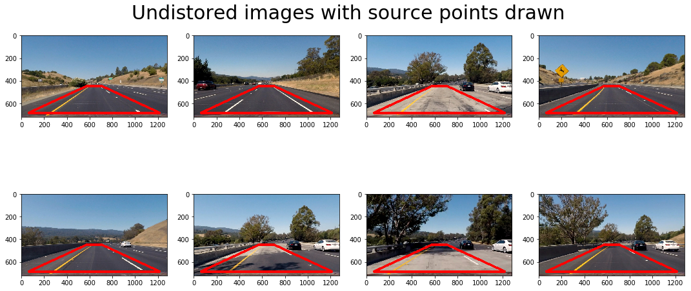


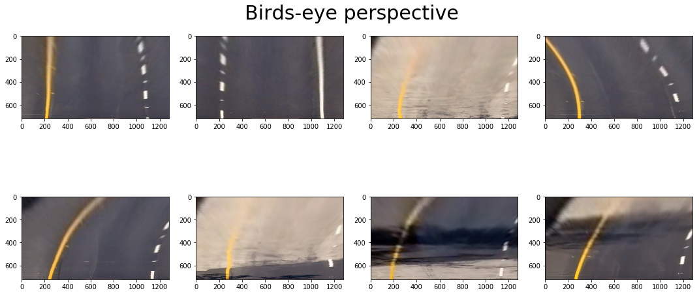


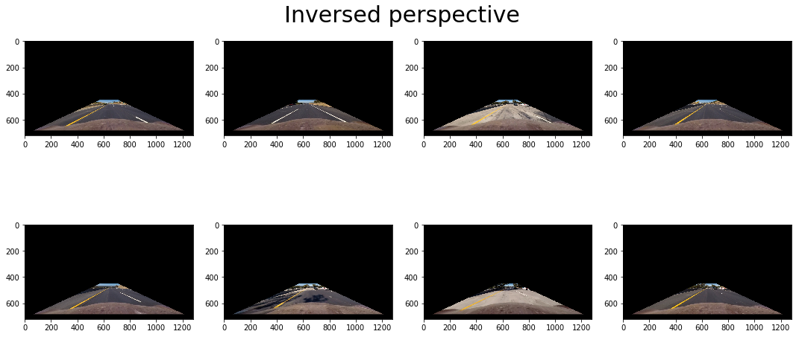


### Task:

*Describe how (and identify where in your code) you used color transforms, gradients or other methods to create a thresholded binary image. Provide an example of a binary image result.*

I convert images into grayscale and then put them into image processing pipeline. The pipeline applies absolute sobel operation with threshold, calculates magnitude of the gradient and it threshold, and then evaluate direction of the gradient and it threshold. Doing all this operation on grayscale image pipeline combine the results into single binary image.


```python
gray_test_images = undistort_images([cv2.cvtColor(img, cv2.COLOR_RGB2GRAY) for img in test_images], mtx, dist)
```


```python
def take_sobel_op(gray, sobel_kernel = 3):
    sobelx = cv2.Sobel(gray, cv2.CV_64F, 1, 0, ksize=sobel_kernel)
    sobely = cv2.Sobel(gray, cv2.CV_64F, 0, 1, ksize=sobel_kernel)
    return sobelx, sobely

def abs_sobel_thresh(sobelx, sobely, orient='x', thresh = (0, 255)):
    
    abs_sobel = np.absolute(sobelx) if orient == 'x' else np.absolute(sobely)
    scaled_sobel = np.uint8(255*abs_sobel/np.max(abs_sobel))
    binary_output = np.zeros_like(scaled_sobel)
    binary_output[(scaled_sobel >= thresh[0]) & (scaled_sobel <= thresh[1])] = 1

    return binary_output

def mag_thresh(sobelx, sobely, thresh=(0, 255)):
    abs_sobel_xy = np.sqrt(sobelx ** 2 + sobely ** 2)
    abs_sobel_xy = (abs_sobel_xy * 255 / np.max(abs_sobel_xy)).astype(np.uint8)

    binary_output = np.zeros_like(abs_sobel_xy)
    binary_output[(abs_sobel_xy >= thresh[0]) & (abs_sobel_xy <= thresh[1])] = 1

    return binary_output


def dir_threshold(sobelx, sobely, thresh=(0, np.pi/2)):
    abs_sobelx, abs_sobely = np.absolute(sobelx), np.absolute(sobely)

    a = np.arctan2(abs_sobely, abs_sobelx)
    
    binary_output = np.zeros_like(a)
    
    binary_output[(a >=thresh[0]) & (a <= thresh[1])] = 1
    return binary_output

def image_processing_pipeline(gray):
    sobelx, sobely = take_sobel_op(gray)
    r = [
        abs_sobel_thresh(orient='x', sobelx=sobelx, sobely=sobely, thresh=(35, 150)),
        abs_sobel_thresh(orient='y', sobelx=sobelx, sobely=sobely, thresh=(10, 150)),
        mag_thresh(sobelx=sobelx, sobely=sobely, thresh=(50, 200)),
        dir_threshold(sobelx=sobelx, sobely=sobely, thresh=(0.7, 1.1))
    ]
    combined = np.zeros_like(sobelx)
    combined[((r[0] == 1) & (r[1] == 1)) | ((r[2] == 1) & (r[3] == 1))] = 1
    
    return combined

def _experiment(gray):
    sobelx, sobely = take_sobel_op(gray)
    result = []
    for i in range(0, 8*10, 10):
        result.append(abs_sobel_thresh(orient='y', sobelx=sobelx, sobely=sobely, thresh=(60,60+i)))
    print(len(result))
    return result
        
converted = [image_processing_pipeline(gray) for gray in gray_test_images]
# converted = _experiment(gray_test_images[0])
display_grid(converted, n_col=4, title="Images after processing in pipeline", cmap='gray')
# gradient_threshold_images = [gradient_threshold(img, (20, 100)) for img in gray_test_images]
# display_grid(gradient_threshold_images)
```


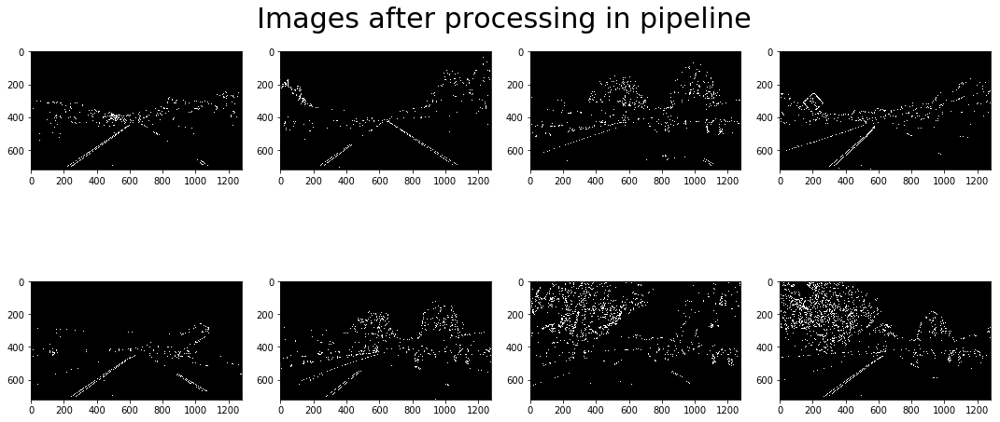


Also we can try to transform colored image from RGB space into HLS, preprocess only Hue and Saturation channels and combine into another binary images.


```python
def hls_select(img, thresh_s=(0, 255), thresh_h=(0, 255)):
    hls = cv2.cvtColor(img, cv2.COLOR_RGB2HLS)
    
    H = hls[:,:,0]
    L = hls[:,:,1]
    S = hls[:,:,2]

    binary_S = np.zeros_like(S)
    binary_S[(S > thresh_s[0]) & (S <= thresh_s[1])] = 1

    binary_H = np.ones_like(H)
    binary_H[(H > thresh_h[0]) & (H <= thresh_h[1])] = 0
    
    combined = np.zeros_like(S)
    combined[(binary_S == 1) & (binary_H == 1)] = 1
    
    return combined

hls_images = [hls_select(img, thresh_s=(150, 255), thresh_h=(150, 255)) for img in test_images]
display_grid(hls_images, cmap='gray',n_col=4, title='Images after processing in HLS color space')
```


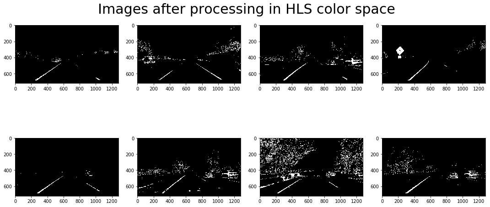


Given these different transformations we can combine them into a single operation.


```python
def combine_sobel_and_hls(images):
    undistored = undistort_images(images, mtx, dist)
    gray_images = [cv2.cvtColor(img, cv2.COLOR_RGB2GRAY) for img in undistored]

    converted = [image_processing_pipeline(gray) for gray in gray_images]
    hls_images = [hls_select(img, thresh_s=(150, 255), thresh_h=(150, 255)) for img in undistored]

    result = []
    for sobel_transformed_image, hls_converted_image in zip(converted, hls_images):
        combined_binary = np.zeros_like(sobel_transformed_image)
        combined_binary[(sobel_transformed_image == 1) | (hls_converted_image == 1)] = 1
        result.append(combined_binary)
        
    return result

display_grid(combine_sobel_and_hls(test_images), cmap='gray',n_col=4, title='All transformations combined')
```


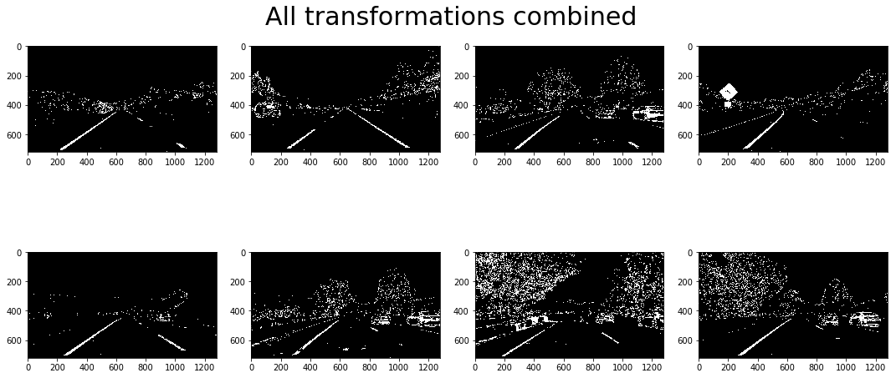


```python
copied_test_images = [img.copy() for img in test_images]
```

Let's look what will happen if we do perspective, color and sobel transformations all together. We will produce binary warped images.


```python
def get_binary_warped_images(input_images):
    binary_images = combine_sobel_and_hls(input_images)
    h, w, *_ = input_images[-1].shape
    corners = [(0.45*w, 0.62*h), (0.55*w, 0.62*h), (0.05*w, 0.95*h), (0.95*w, 0.95*h)]
    return [transform_perspective(image, corners) \
            for i, image in enumerate(binary_images)]

binary_warped = get_binary_warped_images(copied_test_images)
display_grid(binary_warped, cmap='gray',n_col=4, title='Binary warped images')
```


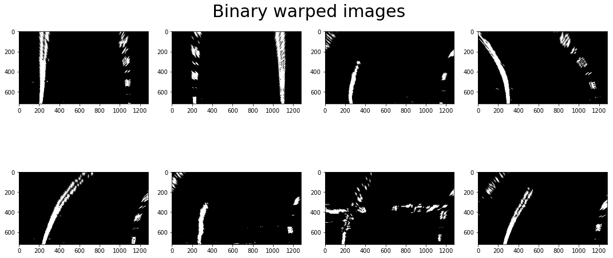


### Task:

*Describe how (and identify where in your code) you identified lane-line pixels and fit their positions with a polynomial?*

To do lane identification I implement `find_lane` function in `LineDetector` class. The algorithm is simple. At first  we try to identify lanes by using histogram and surfing windows to find out peaks that most probably means to be a line center. That is done only on start to init parameters. At following time frames we will only update positions of lanes pixels filtering them around some area.

Given pixels we can try to fit into polynomial curve with help of numpy function `np.polyfit`.

### Task

*Describe how (and identify where in your code) you calculated the radius of curvature of the lane and the position of the vehicle with respect to center.*

I've use handy formula to calculate curviture radius when polynomial is known. There are to implementations: `calculate_curviture` that gives curviture in pixels, and `calculate_curviture_in_m` that gives curviture in meters. 


```python
class LineDetector(object):
    # Set the width of the windows +/- margin
    margin = 100
    # Set minimum number of pixels found to recenter window
    minpix = 50
    out_img = None
    def find_lane(self, binary_warped, draw_frames):
        isFirstCall = self.out_img is None
        # Create an output image to draw on and  visualize the result
        self.out_img = (np.dstack((binary_warped, binary_warped, binary_warped)) * 255).astype(np.uint8)

        if not isFirstCall:
            self.updated_image(binary_warped)
            return
        # Assuming you have created a warped binary image called "binary_warped"
        # Take a histogram of the bottom half of the image
        self.input_shape = binary_warped.shape
        midpoint = np.int(self.input_shape[0]/2)
        histogram = np.sum(binary_warped[midpoint:,:], axis=0)
        # Find the peak of the left and right halves of the histogram
        # These will be the starting point for the left and right lines
        midpoint = np.int(histogram.shape[0]/2)
        leftx_base = np.argmax(histogram[:midpoint])
        rightx_base = np.argmax(histogram[midpoint:]) + midpoint

        # Choose the number of sliding windows
        nwindows = 9
        # Set height of windows
        window_height = np.int(self.input_shape[0]/nwindows)
        # Identify the x and y positions of all nonzero pixels in the image
        nonzero = binary_warped.nonzero()
        self.nonzeroy = np.array(nonzero[0])
        self.nonzerox = np.array(nonzero[1])
        # Current positions to be updated for each window
        leftx_current = leftx_base
        rightx_current = rightx_base
        # Create empty lists to receive left and right lane pixel indices
        self.left_lane_inds = []
        self.right_lane_inds = []

        # Step through the windows one by one
        for window in range(nwindows):
            # Identify window boundaries in x and y (and right and left)
            win_y_low = self.input_shape[0] - (window+1)*window_height
            win_y_high = self.input_shape[0] - window*window_height
            win_xleft_low = leftx_current - self.margin
            win_xleft_high = leftx_current + self.margin
            win_xright_low = rightx_current - self.margin
            win_xright_high = rightx_current + self.margin
            if draw_frames:
                # Draw the windows on the visualization image
                cv2.rectangle(self.out_img,(win_xleft_low,win_y_low),(win_xleft_high,win_y_high),
                (0,255,0), 4) 
                cv2.rectangle(self.out_img,(win_xright_low,win_y_low),(win_xright_high,win_y_high),
                (0,255,0), 4) 
            # Identify the nonzero pixels in x and y within the window
            good_left_inds = ((self.nonzeroy >= win_y_low) & (self.nonzeroy < win_y_high) & 
            (self.nonzerox >= win_xleft_low) &  (self.nonzerox < win_xleft_high)).nonzero()[0]
            good_right_inds = ((self.nonzeroy >= win_y_low) & (self.nonzeroy < win_y_high) & 
            (self.nonzerox >= win_xright_low) &  (self.nonzerox < win_xright_high)).nonzero()[0]
            # Append these indices to the lists
            self.left_lane_inds.append(good_left_inds)
            self.right_lane_inds.append(good_right_inds)
            # If you found > minpix pixels, recenter next window on their mean position
            if len(good_left_inds) > self.minpix:
                leftx_current = np.int(np.mean(self.nonzerox[good_left_inds]))
            if len(good_right_inds) > self.minpix:        
                rightx_current = np.int(np.mean(self.nonzerox[good_right_inds]))

        # Concatenate the arrays of indices
        self.left_lane_inds = np.concatenate(self.left_lane_inds)
        self.right_lane_inds = np.concatenate(self.right_lane_inds)

        # Extract left and right line pixel positions
        leftx = self.nonzerox[self.left_lane_inds]
        lefty = self.nonzeroy[self.left_lane_inds] 
        rightx = self.nonzerox[self.right_lane_inds]
        righty = self.nonzeroy[self.right_lane_inds] 

        # Fit a second order polynomial to each
        self.left_fit = np.polyfit(lefty, leftx, 2)
        self.right_fit = np.polyfit(righty, rightx, 2)

    def updated_image(self, binary_warped):
        nonzero = binary_warped.nonzero()
        self.nonzeroy = np.array(nonzero[0])
        self.nonzerox = np.array(nonzero[1])
        margin = self.margin
        self.left_lane_inds = ((self.nonzerox > (self.left_fit[0]*(self.nonzeroy**2) + self.left_fit[1]*self.nonzeroy + 
        self.left_fit[2] - margin)) & (self.nonzerox < (self.left_fit[0]*(self.nonzeroy**2) + 
        self.left_fit[1]*self.nonzeroy + self.left_fit[2] + margin))) 

        self.right_lane_inds = ((self.nonzerox > (self.right_fit[0]*(self.nonzeroy**2) + self.right_fit[1]*self.nonzeroy + 
        self.right_fit[2] - margin)) & (self.nonzerox < (self.right_fit[0]*(self.nonzeroy**2) + 
        self.right_fit[1]*self.nonzeroy + self.right_fit[2] + margin)))  

        # Again, extract left and right line pixel positions
        leftx = self.nonzerox[self.left_lane_inds]
        lefty = self.nonzeroy[self.left_lane_inds] 
        rightx = self.nonzerox[self.right_lane_inds]
        righty = self.nonzeroy[self.right_lane_inds]
        # Fit a second order polynomial to each
        self.left_fit = np.polyfit(lefty, leftx, 2)
        self.right_fit = np.polyfit(righty, rightx, 2)

    def get_out_image(self, **kwargs):
        # Generate x and y values for plotting
        ploty = np.linspace(0, self.input_shape[0]-1, self.input_shape[0] )
        left_fitx = self.left_fit[0]*ploty**2 + self.left_fit[1]*ploty + self.left_fit[2]
        right_fitx = self.right_fit[0]*ploty**2 + self.right_fit[1]*ploty + self.right_fit[2]

        window_img = np.zeros_like(self.out_img)
        self.out_img[self.nonzeroy[self.left_lane_inds], self.nonzerox[self.left_lane_inds]] = (255, 0, 0)
        self.out_img[self.nonzeroy[self.right_lane_inds], self.nonzerox[self.right_lane_inds]] = [0, 0, 255]

        # Generate a polygon to illustrate the search window area
        # And recast the x and y points into usable format for cv2.fillPoly()
        left_line_window1 = np.array([np.transpose(np.vstack([left_fitx-self.margin, ploty]))])
        left_line_window2 = np.array([np.flipud(np.transpose(np.vstack([left_fitx+self.margin, 
                                      ploty])))])
        left_line_pts = np.hstack((left_line_window1, left_line_window2))
        right_line_window1 = np.array([np.transpose(np.vstack([right_fitx-self.margin, ploty]))])
        right_line_window2 = np.array([np.flipud(np.transpose(np.vstack([right_fitx+self.margin, 
                                      ploty])))])
        right_line_pts = np.hstack((right_line_window1, right_line_window2))

        # Draw the lane onto the warped blank image
        cv2.fillPoly(window_img, np.int_([left_line_pts]), (0,255, 0))
        cv2.fillPoly(window_img, np.int_([right_line_pts]), (0,255, 0))
        result = cv2.addWeighted(self.out_img, 1, window_img, 0.3, 0)
        
        return result
    
    def visualize_lines(self):
        result = self.get_out_image()
        plt.imshow(result)
#         plt.plot(left_fitx, ploty, color='yellow')
#         plt.plot(right_fitx, ploty, color='yellow')
        plt.xlim(0, 1280)
        plt.ylim(720, 0)
        
        

    def calculate_curviture_in_m(self):
        ym_per_pix = 30/720 # meters per pixel in y dimension
        xm_per_pix = 3.7/900 # meters per pixel in x dimension

        # Fit new polynomials to x,y in world space
        ploty = np.linspace(0, 719, num=720)

        leftx = self.left_fit[0]*ploty**2 + self.left_fit[1]*ploty + self.left_fit[2]
        rightx = self.right_fit[0]*ploty**2 + self.right_fit[1]*ploty + self.right_fit[2]
        y_eval = np.max(ploty)

        left_fit_cr = np.polyfit(ploty*ym_per_pix, leftx*xm_per_pix, 2)
        right_fit_cr = np.polyfit(ploty*ym_per_pix, rightx*xm_per_pix, 2)
        # Calculate the new radii of curvature
        left_curverad = ((1 + (2*left_fit_cr[0]*y_eval*ym_per_pix + left_fit_cr[1])**2)**1.5) / np.absolute(2*left_fit_cr[0])
        right_curverad = ((1 + (2*right_fit_cr[0]*y_eval*ym_per_pix + right_fit_cr[1])**2)**1.5) / np.absolute(2*right_fit_cr[0])
        # Now our radius of curvature is in meters

        pos = ((rightx[-1] + leftx[-1])/ 2 - 1280 / 2) * xm_per_pix
        return left_curverad, right_curverad, pos
        
    def calculate_curviture(self):
        ploty = np.linspace(0, 719, num=720)
        y_eval = np.max(ploty)
        left_curverad = ((1 + (2*self.left_fit[0]*y_eval + self.left_fit[1])**2)**1.5) / np.absolute(2*self.left_fit[0])
        right_curverad = ((1 + (2*self.right_fit[0]*y_eval + self.right_fit[1])**2)**1.5) / np.absolute(2*self.right_fit[0])
        return left_curverad, right_curverad
    
    curviture_stack = []
    def print_curviture(self, image):
        l, r, p = self.calculate_curviture_in_m()
        value = (l+r)/2.
        self.curviture_stack.append(value)
        if (len(self.curviture_stack) > 20):
            self.curviture_stack.pop(0)
        mean_value = np.median(self.curviture_stack)
        text = "Curviture: {:.1f} m".format(mean_value)
        cv2.putText(image, text, (10, 100), cv2.FONT_ITALIC, 3.0, (11,71,145), 10, cv2.LINE_AA)
        
        text = "Position: {:.2f} m".format(p)
        cv2.putText(image, text, (10, 200), cv2.FONT_ITALIC, 3.0, (11,71,145), 10, cv2.LINE_AA)
        
    
    def restore_lanes_on_image(self, image):
        # Create an image to draw the lines on
        ploty = np.linspace(0, self.input_shape[0]-1, self.input_shape[0] )
        left_fitx = self.left_fit[0]*ploty**2 + self.left_fit[1]*ploty + self.left_fit[2]
        right_fitx = self.right_fit[0]*ploty**2 + self.right_fit[1]*ploty + self.right_fit[2]

        warp_zero = np.zeros(self.input_shape).astype(np.uint8)
        color_warp = np.dstack((warp_zero, warp_zero, warp_zero))
        
        # Recast the x and y points into usable format for cv2.fillPoly()
        pts_left = np.array([np.transpose(np.vstack([left_fitx, ploty]))])
        pts_right = np.array([np.flipud(np.transpose(np.vstack([right_fitx, ploty])))])
        pts = np.hstack((pts_left, pts_right))

        # Draw the lane onto the warped blank image
        cv2.fillPoly(color_warp, np.int_([pts]), (0,255, 0))

        # Warp the blank back to original image space using inverse perspective matrix (Minv)
        corners = get_corners(self.input_shape[1], self.input_shape[0])
        newwarp = transform_perspective(color_warp, corners, inverted=True)
        # Combine the result with the original image
        return cv2.addWeighted(image, 1, newwarp, 0.3, 0)
```

Let's try our detector on test images:


```python
detected_lines_images = []
for image in test_images:
    detector = LineDetector()
    
    input_images = [image]
    binary_images = combine_sobel_and_hls(input_images)
    h, w, *_ = input_images[-1].shape
    corners = get_corners(w, h)
    binary_warped = [transform_perspective(image, corners) \
                     for i, image in enumerate(binary_images)]

    detector.find_lane(binary_warped[0], draw_frames=False)
    image = detector.restore_lanes_on_image(image)
    detector.print_curviture(image)
    
    detected_lines_images.append(image)
    
display_grid(detected_lines_images, n_col=4, title='Images with identified lanes')

```


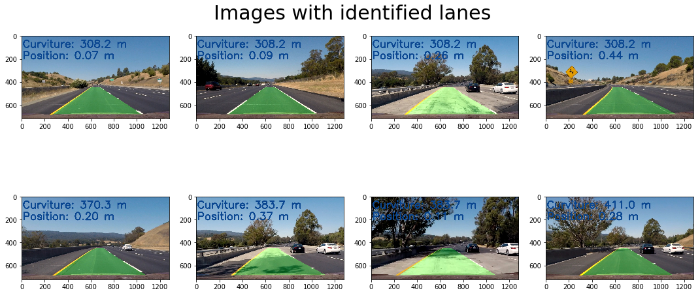


---

## Pipeline (video)

### Task

*Provide a link to your final video output. Your pipeline should perform reasonably well on the entire project video (wobbly lines are ok but no catastrophic failures that would cause the car to drive off the road!)*

Import tools to make video output.


```python
# Import everything needed to edit/save/watch video clips
from moviepy.editor import VideoFileClip
from IPython.display import HTML
```

Define `process_image` method that will accept image, process it and visualize all calculations done - curviture radius, offset from the center of lane and area between lines itself.


```python
def process_image(image):
    global detector
    input_images = [image]
    binary_images = combine_sobel_and_hls(input_images)
    h, w, *_ = input_images[-1].shape
    corners = get_corners(w, h)
    binary_warped = [transform_perspective(image, corners) \
                     for i, image in enumerate(binary_images)]

    detector.find_lane(binary_warped[0], draw_frames=False)
    image = detector.restore_lanes_on_image(image)
    detector.print_curviture(image)
    return image
```

Now we can export video using our pipeline:


```python
white_output = 'out/project_video.mp4'
del detector
detector = LineDetector()

## To speed up the testing process you may want to try your pipeline on a shorter subclip of the video
## To do so add .subclip(start_second,end_second) to the end of the line below
## Where start_second and end_second are integer values representing the start and end of the subclip
## You may also uncomment the following line for a subclip of the first 5 seconds
##clip1 = VideoFileClip("test_videos/solidWhiteRight.mp4").subclip(0,5)
clip1 = VideoFileClip("project_video.mp4")
white_clip = clip1.fl_image(process_image) #NOTE: this function expects color images!!
%time white_clip.write_videofile(white_output, audio=False)
```

    [MoviePy] >>>> Building video out/project_video.mp4
    [MoviePy] Writing video out/project_video.mp4


    100%|█████████▉| 1260/1261 [05:26<00:00,  3.73it/s]


    [MoviePy] Done.
    [MoviePy] >>>> Video ready: out/project_video.mp4 
    
    CPU times: user 4min 12s, sys: 1min 31s, total: 5min 43s
    Wall time: 5min 28s


---

### Discussion

### Task

*Briefly discuss any problems / issues you faced in your implementation of this project. Where will your pipeline likely fail? What could you do to make it more robust?*

It is rather interesting project and helpful in meaning that it describes such new topics for me as color and perspective transformation, Sobel operator and others. It was difficult in process of identifing proper parameters when combining different binary images taken after different transformations. The result is stable without any mistake during the whole video. And I'm very satisfied with that.


```python

```
